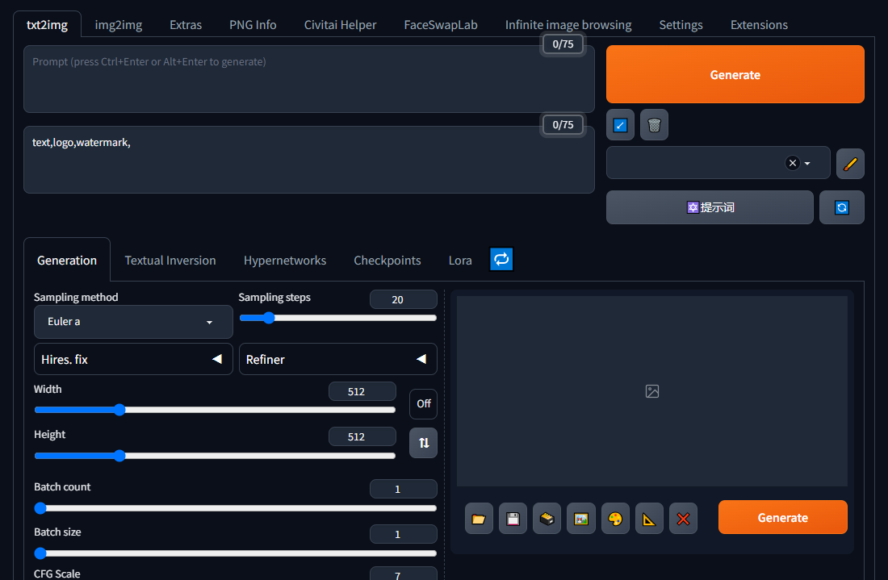
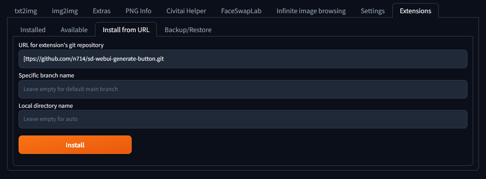

# sd-webui-generate-button

Additional Generate button alway with you.

[](https://www.buymeacoffee.com/n714mc)




## Installation
``` get clone https://github.com/n714/sd-webui-generate-button.git ```

# 如何安装 sd-webui-generate-button 简体中文

  ## 1.通过网址安装
  
  - 点击 `Extension` 选项卡，点击 `Install from URL` 子选项卡
  - 复制本 git 仓库网址：

```
[ttps://github.com/n714/sd-webui-generate-button.git
```

 
  - 粘贴进 URL 栏，点击 `Install`，如图
  
  - 安装完成，  

  ## 2. 又或者，直接下载然后放在对应路径
  [下载本 git 仓库](https://github.com/n714/sd-webui-generate-button/archive/refs/heads/main.zip) 为 zip 档案

``` get clone https://github.com/n714/sd-webui-generate-button.git ```

  - 解压，并把文件夹放置在 webui 根目录下的 `extensions` 文件夹中，放好之后, 重新webui.
  - 安装完成.
